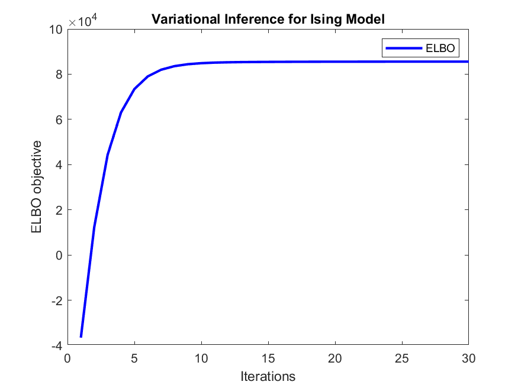

# Probabilistic Graphical Models — Variational Inference and Causal Discovery

This repository presents a set of implementations focusing on **variational inference for image denoising** and **causal structure learning** using the **PC algorithm**.  
All experiments and visualizations were performed in **MATLAB**, demonstrating the practical use of probabilistic modeling and inference in graphical models.

---

## 📘 Project Overview

The work consists of two main parts:

### 🧩 Variational Inference in Binary Image Denoising  
In this part, we used **Variational Inference (VI)** with the **Ising Model** to perform denoising on a binary image corrupted by random noise.  
The **Mean-Field Approximation** was applied to simplify dependencies between neighboring pixels and estimate the posterior distribution efficiently.

#### Key Steps:
- Defined the Ising graphical model for binary pixel values (`x ∈ {-1, +1}`).
- Formulated the **ELBO** (Evidence Lower Bound) objective for optimization.  
- Applied iterative mean-field updates to minimize entropy and maximize ELBO.  
- Reconstructed the clean image from the noisy observation.

#### Results:
- The average entropy decreased steadily, showing convergence of the mean-field approximation.  
- The ELBO objective increased across iterations, confirming stable variational optimization.  
- The denoised image closely matches the original, demonstrating the model’s effectiveness in removing noise.

| Input (Noisy) | Output (Denoised) |
|----------------|-------------------|
|  |  |

**Convergence Plots:**

- *Average Entropy:*  
  

- *ELBO Objective:*  
  

---

### 🔍 Causal Discovery using the PC Algorithm  
This part explores causal structure learning using the **PC (Peter-Clark) algorithm**, a constraint-based method for discovering directed acyclic graphs (DAGs) from data.

#### Method Summary:
1. **Skeleton Construction:**  
   - Start from a fully connected undirected graph.  
   - Perform **conditional independence tests** and remove edges where independence holds.  
   - Record separating sets for removed edges.

2. **Edge Orientation:**  
   - Detect **V-structures (X → Z ← Y)** based on separation sets.  
   - Apply propagation rules to ensure consistency and acyclicity.

#### Advantages:
- Scalable and computationally efficient for large datasets.  
- Does not assume a fixed parametric model.  
- Can be used with both discrete and continuous variables.

#### Limitations:
- Sensitive to the accuracy of independence tests.  
- Results depend on data quality and sample size.  
- Interpretation of resulting graphs may be nontrivial.

| Example Visualization |
|------------------------|
|  |

---

## 📊 Results Summary

| Task | Method | Outcome |
|------|---------|----------|
| Image Denoising | Variational Inference (Ising Model) | Noise effectively removed; ELBO convergence achieved |
| Causal Discovery | PC Algorithm | DAG of variable dependencies successfully reconstructed |

---

## 🚀 How to Run

1. Open MATLAB and run the corresponding scripts for each section.

   ```matlab
   % Variational inference section
   run('PGM_Variational_Inference.m')

   % Causal discovery section
   run('PGM_PC_Algorithm.m')
